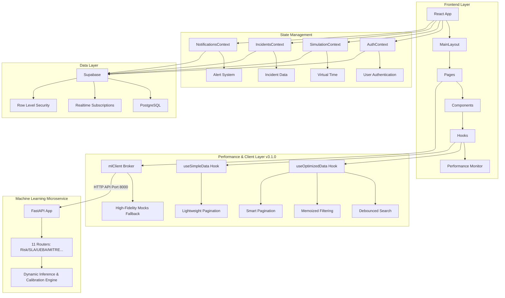
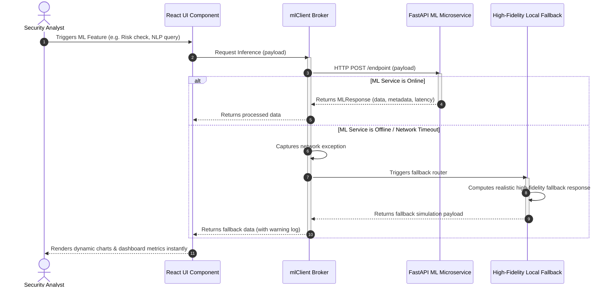
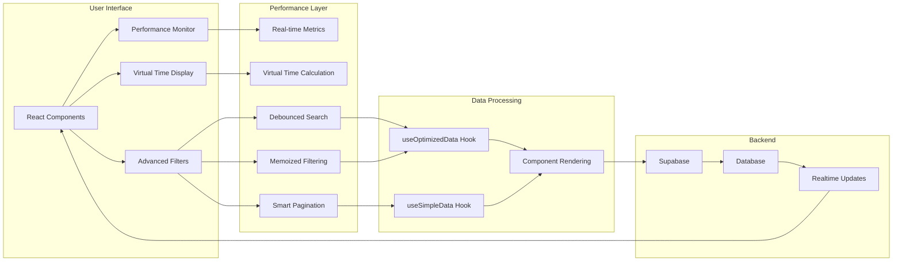

# IRIS.SEC - Architecture Diagrams

## System Architecture Overview



## ML Inference & High-Fidelity Local Fallback Flow



## Performance Optimization Architecture



## Log Ingestion Module Architecture

```
┌─────────────────────────────────────────────────────────────────────┐
│                         IRIS-SOC PLATFORM                            │
│                                                                       │
│  ┌──────────────────────────────────────────────────────────────┐  │
│  │                    EXISTING SYSTEM                            │  │
│  │  ┌────────────────┐  ┌────────────────┐  ┌────────────────┐ │  │
│  │  │  Simulation    │  │   Dashboard    │  │     Alerts      │ │  │
│  │  │    Context     │  │   (Realtime)   │  │     Table       │ │  │
│  │  └────────────────┘  └────────────────┘  └────────────────┘ │  │
│  │         ↑                    ↑                    ↑          │  │
│  │         │                    │                    │          │  │
│  │         │              REALTIME SUBSCRIPTION      │          │  │
│  │         │                    │                    │          │  │
│  │         │                    └────────────────────┘          │  │
│  │         │                                                    │  │
│  │    NO INTERACTION          AUTOMATIC UPDATES               │  │
│  └──────────────────────────────────────────────────────────────┘  │
│                                                                      │
│  ┌──────────────────────────────────────────────────────────────┐  │
│  │              🆕 LOG INGESTION MODULE (ISOLATED)               │  │
│  │                                                                │  │
│  │  ┌────────────────────────────────────────────────────────┐  │  │
│  │  │                    User Interface                       │  │  │
│  │  │  /log-ingestion page (LogIngestion.tsx)                │  │  │
│  │  │  • File Upload                                         │  │  │
│  │  │  • Preview                                             │  │  │
│  │  │  • Progress Tracking                                   │  │  │
│  │  │  • Statistics Display                                  │  │  │
│  │  │  • Sample Generator                                    │  │  │
│  │  └─────────────────┬──────────────────────────────────────┘  │  │
│  │                    │                                          │  │
│  │                    ▼                                          │  │
│  │  ┌────────────────────────────────────────────────────────┐  │  │
│  │  │              Log Parser (logParser.ts)                  │  │  │
│  │  │  • File Validation                                     │  │  │
│  │  │  • Content Reading                                     │  │  │
│  │  │  • Pattern Matching (10 rules)                         │  │  │
│  │  │  • Metadata Extraction                                 │  │  │
│  │  │  • Risk Scoring                                        │  │  │
│  │  └─────────────────┬──────────────────────────────────────┘  │  │
│  │                    │                                          │  │
│  │                    ▼                                          │  │
│  │  ┌────────────────────────────────────────────────────────┐  │  │
│  │  │     Log Ingestion Service (LogIngestionService.ts)     │  │  │
│  │  │  • Duplicate Detection                                 │  │  │
│  │  │  • Alert Payload Generation                            │  │  │
│  │  │  • Batch Processing                                    │  │  │
│  │  │  • Error Handling                                      │  │  │
│  │  └─────────────────┬──────────────────────────────────────┘  │  │
│  │                    │                                          │  │
│  │                    │ INSERT ONLY                              │  │
│  │                    ▼                                          │  │
│  │  ┌────────────────────────────────────────────────────────┐  │  │
│  │  │            Supabase alerts Table                        │  │  │
│  │  │  • Receives new alerts                                 │  │  │
│  │  │  • Triggers realtime subscription                      │  │  │
│  │  │  • NO schema changes                                   │  │  │
│  │  └────────────────────────────────────────────────────────┘  │  │
│  └──────────────────────────────────────────────────────────────┘  │
└─────────────────────────────────────────────────────────────────────┘
```

## Data Flow Sequence

```
┌──────┐     ┌────────┐     ┌──────────┐     ┌─────────┐     ┌──────────┐
│ User │────▶│  File  │────▶│  Parser  │────▶│ Service │────▶│ Database │
└──────┘     └────────┘     └──────────┘     └─────────┘     └──────────┘
   │             │              │                 │               │
   │ 1. Upload   │              │                 │               │
   │             │ 2. Validate  │                 │               │
   │             │              │                 │               │
   │             │────────────▶ │ 3. Parse        │               │
   │             │              │   • Match Rules │               │
   │             │              │   • Extract IPs │               │
   │             │              │   • Score Risk  │               │
   │             │              │                 │               │
   │             │              │────────────────▶│ 4. Process    │
   │             │              │                 │   • Check Dup │
   │             │              │                 │   • Build JSON│
   │             │              │                 │               │
   │             │              │                 │──────────────▶│ 5. INSERT
   │             │              │                 │               │
   │             │              │                 │◀──────────────│ 6. Success
   │             │              │                 │               │
   │             │              │◀────────────────│ 7. Summary    │
   │             │              │                 │               │
   │◀────────────│──────────────│─────────────────│               │
   │ 8. Display                                                   │
   │    Results                                                   │
   │                                                               │
   │                                  ┌────────────────────────┐  │
   │                                  │  Realtime Subscription │  │
   │                                  │  automatically updates │◀─┘
   │                                  │  dashboard with new    │
   │                                  │  alerts                │
   └──────────────────────────────────└────────────────────────┘
```

## Detection Rule Processing

```
┌─────────────────────────────────────────────────────────────────┐
│                    Log File Content                              │
│  Line 1: 2024-02-12 [AUTH] Failed password from 10.0.0.1        │
│  Line 2: 2024-02-12 [WEB] GET /admin?id=' OR 1=1                │
│  Line 3: 2024-02-12 [AV] Detected malware in file.exe          │
│  ...                                                             │
└────────────────────────┬────────────────────────────────────────┘
                         │
                         ▼
         ┌───────────────────────────────┐
         │   Pattern Matching Engine      │
         └───────────────────────────────┘
                         │
         ┌───────────────┴───────────────┐
         │                               │
         ▼                               ▼
┌────────────────────┐         ┌────────────────────┐
│  Rule 1: SSH       │         │  Rule 2: SQL       │
│  Brute Force       │         │  Injection         │
│  Pattern:          │         │  Pattern:          │
│  /failed.*password/│         │  /' OR 1=1/       │
│  Match: Line 1 ✓   │         │  Match: Line 2 ✓   │
└────────────────────┘         └────────────────────┘
         │                               │
         ▼                               ▼
┌────────────────────┐         ┌────────────────────┐
│  Extract Metadata  │         │  Extract Metadata  │
│  • IP: 10.0.0.1    │         │  • IP: ...         │
│  • Time: 10:15     │         │  • Query: ...      │
│  • Count: 5        │         │  • Count: 3        │
└────────────────────┘         └────────────────────┘
         │                               │
         ▼                               ▼
┌────────────────────┐         ┌────────────────────┐
│  Calculate Risk    │         │  Calculate Risk    │
│  Base: 75          │         │  Base: 95          │
│  + Frequency: +10  │         │  + Frequency: +5   │
│  + IP Diversity: 0 │         │  + IP Diversity: 0 │
│  = Total: 85       │         │  = Total: 100      │
│  Severity: HIGH    │         │  Severity: CRITICAL│
└────────────────────┘         └────────────────────┘
         │                               │
         └───────────┬───────────────────┘
                     │
                     ▼
         ┌───────────────────────┐
         │   Alert Generation     │
         │   • Title              │
         │   • Description        │
         │   • Metadata           │
         │   • Severity           │
         │   • Resolution         │
         └───────────────────────┘
                     │
                     ▼
         ┌───────────────────────┐
         │  INSERT into alerts    │
         └───────────────────────┘
```

## Component Interaction

```
┌─────────────────────────────────────────────────────────────┐
│                      src/pages/                              │
│                   LogIngestion.tsx                           │
│  ┌─────────────┐  ┌──────────────┐  ┌──────────────┐       │
│  │   Upload    │  │   Analyze    │  │   Generate   │       │
│  │   Button    │─▶│   Button     │─▶│   Button     │       │
│  └─────────────┘  └──────────────┘  └──────────────┘       │
│         │                │                  │                │
└─────────┼────────────────┼──────────────────┼────────────────┘
          │                │                  │
          │                │                  │
          ▼                ▼                  ▼
┌─────────────────┐ ┌──────────────┐ ┌──────────────────────┐
│  src/utils/     │ │  src/utils/  │ │  src/services/       │
│  logParser.ts   │ │  logParser.ts│ │  LogIngestionSvc.ts  │
├─────────────────┤ ├──────────────┤ ├──────────────────────┤
│ validateLogFile │ │ parseLogFile │ │ processDetections    │
│ readFileContent │ │              │ │                      │
└─────────────────┘ └──────────────┘ └──────────────────────┘
                           │                  │
                           │                  │
                           ▼                  ▼
                   ┌──────────────┐  ┌──────────────────┐
                   │ Detection    │  │ Alert Payload    │
                   │ Results      │  │ Generation       │
                   └──────────────┘  └──────────────────┘
                                              │
                                              ▼
                                     ┌─────────────────┐
                                     │ Supabase Client │
                                     │ .from('alerts') │
                                     │ .insert()       │
                                     └─────────────────┘
```

## Type System

```
┌──────────────────────────────────────────────────────┐
│            src/types/logIngestion.ts                  │
├──────────────────────────────────────────────────────┤
│                                                       │
│  LogEntry           ─┐                               │
│  DetectionRule      ─┤                               │
│  LogMatch           ─┼─▶  Used by Parser             │
│  LogDetection       ─┤                               │
│  ParsedLogResult    ─┘                               │
│                                                       │
│  AlertPayload       ─┐                               │
│  ProcessingSummary  ─┼─▶  Used by Service            │
│                      ─┘                               │
│                                                       │
│  LogSeverity        ─── Common Types                 │
│                                                       │
└──────────────────────────────────────────────────────┘
```

## Isolation Boundaries

```
╔═══════════════════════════════════════════════════════════╗
║                    ISOLATION LAYER                         ║
╠═══════════════════════════════════════════════════════════╣
║                                                            ║
║  ┌─────────────────────────────────────────────────────┐  ║
║  │  Log Ingestion Module (NEW)                         │  ║
║  │  • Own types                                        │  ║
║  │  • Own parser                                       │  ║
║  │  • Own service                                      │  ║
║  │  • Own page component                               │  ║
║  │  • No imports from SimulationContext ✓              │  ║
║  │  • No imports from existing alert code ✓            │  ║
║  └─────────────────────────────────────────────────────┘  ║
║                           │                                ║
║                           │ Only shared:                   ║
║                           │ - Supabase client              ║
║                           │ - Existing table schema        ║
║                           │                                ║
║  ════════════════════════════════════════════════════════  ║
║                                                            ║
║  ┌─────────────────────────────────────────────────────┐  ║
║  │  Existing IRIS-SOC System                           │  ║
║  │  • SimulationContext (unchanged)                    │  ║
║  │  • Alert types (unchanged)                          │  ║
║  │  • Dashboard (unchanged)                            │  ║
║  │  • Real-time subscription (unchanged)               │  ║
║  └─────────────────────────────────────────────────────┘  ║
║                                                            ║
╚═══════════════════════════════════════════════════════════╝
```

## Error Handling Flow

```
┌─────────────────────────────────────────────────────────┐
│                    Error Handling                        │
└─────────────────────────────────────────────────────────┘
                          │
          ┌───────────────┼───────────────┐
          ▼               ▼               ▼
   ┌────────────┐  ┌────────────┐  ┌────────────┐
   │  Upload    │  │  Parse     │  │  Database  │
   │  Validation│  │  Errors    │  │  Errors    │
   └────────────┘  └────────────┘  └────────────┘
          │               │               │
          ▼               ▼               ▼
   • File type     • Invalid     • Connection
   • File size       format        failed
   • Empty file    • Corrupt      • Insert
                     content        failed
                                  • Timeout
          │               │               │
          └───────────────┼───────────────┘
                          ▼
                  ┌─────────────────┐
                  │  Toast Notify   │
                  │  • Clear message│
                  │  • User action  │
                  │  • No crash     │
                  └─────────────────┘
```

## Future Enhancement Path

```
                    Current Implementation
                            │
                            ▼
              ┌─────────────────────────┐
              │  File Upload (Manual)   │
              │  • .log / .txt files    │
              │  • One-time processing  │
              └─────────────────────────┘
                            │
                            ▼ Future Enhancement
              ┌─────────────────────────┐
              │  Real-time Streaming    │
              │  • WebSocket / SSE      │
              │  • Live log tails       │
              │  • Continuous detection │
              └─────────────────────────┘
                            │
                            ▼ Future Enhancement
              ┌─────────────────────────┐
              │  ML Anomaly Detection   │
              │  • Train on patterns    │
              │  • Detect unknowns      │
              │  • Auto-tune rules      │
              └─────────────────────────┘
                            │
                            ▼ Future Enhancement
              ┌─────────────────────────┐
              │  Alert Correlation      │
              │  • Link related alerts  │
              │  • Build attack chains  │
              │  • Auto-escalate        │
              └─────────────────────────┘
```

---

**Legend:**
- `─▶` : Data flow
- `┌─┐` : Component boundaries
- `═══` : Isolation layer
- `✓`   : Verified safe
